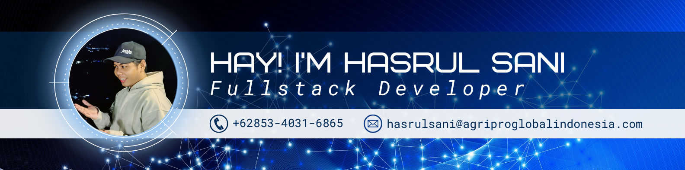

<!-- <h1 align="center" style="margin-bottom: 10px;">
  
    Hi there
    👋
      ✨
     I'm Hasrul Sani  ✨
  
</h1> -->

<h3 align="center" style="
  margin: 0.5rem 0;
  font-weight: 700;
  font-size: 1.1em;
  background: linear-gradient(90deg, rgba(20, 83, 45, 0.15), rgba(132, 204, 22, 0.15), rgba(20, 83, 45, 0.15));
  padding: 10px 20px;
  border-radius: 30px;
  display: inline-block;
  border: 1px solid rgba(132, 204, 22, 0.4);
  box-shadow: 0 4px 6px -1px rgba(132, 204, 22, 0.1), 0 2px 4px -1px rgba(132, 204, 22, 0.06);
">
  🚀 
  Full Stack Developer 
  • 
  🤖 
  ML Enthusiast 
  • 
  📱 
  Mobile Explorer
</h3>

  

---

### 🛠️ Tech Stack & Tools

  
| Category       | Technologies                                                                 |
|----------------|------------------------------------------------------------------------------|
| **Frontend**   |       | 
| **Backend**    |   |
| **Mobile**     |   |
| **Database**   |    |
| **Tools**      |     |

---

### 🎮 What I Do

  
🎯 **Web Development**: Building responsive SPA with React & Next.js  
🧠 **Machine Learning**: Exploring ML algorithms with Python  
📱 **Mobile Apps**: Developing Android apps with Kotlin  
🔍 **Problem Solving**: Crafting elegant solutions to complex problems  
✨ **UI/UX**: Creating beautiful, intuitive interfaces

---

### 🌱 Currently Learning

  
📊 **Data Science**:     
🤖 **AI/ML**:    
☁️ **Cloud**:  

---

### 📊 GitHub Stats

  
  
  

---

### 📫 Let's Connect

  
  
  
  
  

---

### 🌍 Language Skills & Fun Facts

<!-- Language Badges -->

  

    
    Bahasa Indonesia (Native)
  

  
  

    
    English (Professional)
  

<!-- Activity Grid -->

  

    

      
    

    
Coding Day & Night

  

  

    

      
    

    
Jogging & Gym Clear My Mind

  

  

    

      
    

    
Travel  ,Find Inspiration

  

  

    

      
    

    
Bilingual  ID + EN

  

  <!-- Meditation -->
  

    

      
    

    
Meditation Find Balance

  

  <!-- Eating -->
  

    

      
    

    
Healthy Eating Fuel My Code

  

<!-- Quote -->

  printf("Hello World in 2 tongues");  
Saya menulis kode yang bicara bahasa manusia dan mesin 🤖"

###

<picture>
  <source media="(prefers-color-scheme: dark)" srcset="https://raw.githubusercontent.com/arul340/arul340/output/pacman-contribution-graph-dark.svg">
  <source media="(prefers-color-scheme: light)" srcset="https://raw.githubusercontent.com/arul340/arul340/output/pacman-contribution-graph.svg">
  
</picture>

###
